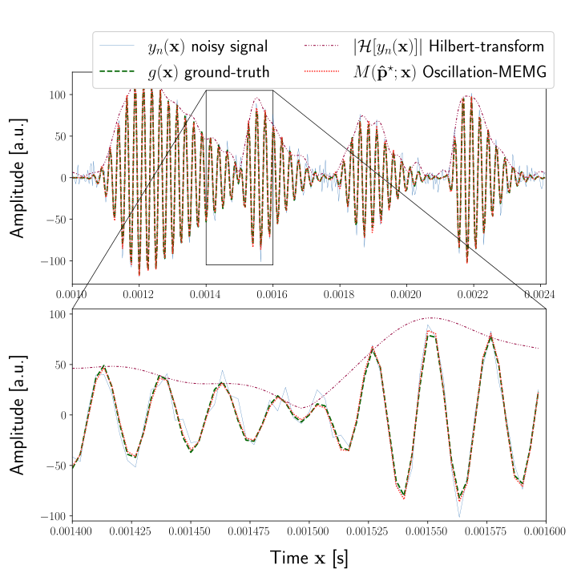

# Multimodal Exponentially Modified Gaussians

[](https://arxiv.org/pdf/2209.12202.pdf)

## Quick Facts
- multiple asymmetric Gaussian distributions for the univariate case
- optional oscillation term for wave approximations
- based on [analytical derivation](./docs/exp_mod_gauss_wave_partial_derivative.pdf)
- accepts ```numpy``` as well as ```torch``` data types

## Kick Start

Below is a code excerpt for fitting multi-modal skewed Gaussian distributions:

```python

from multimodal_emg import gaussian_envelope_model, emg_envelope_model, emg_wave_model
from multimodal_emg.regression.derivatives import gaussian_jac, emg_jac, oemg_jac

# multimodal optimization
p_star, result = multimodal_fit(
    data,
    features = [[1, 24, 2, 0],[.5, 48, 3, -1]], # amplitude, location, spread, skew
    components = 2,
    x = x,
    fun = emg_envelope_model,
    jac_fun = emg_jac,
)

print(p_star)

import matplotlib.pyplot as plt
plt.plot(result)
plt.show()
```

## Oscillating Regression

The oscillation regression can be found in the accompanied [Jupyter Notebook](./single_synth_memg_example.ipynb) which yields the below result:

[](./single_synth_memg_example.ipynb)

## Citation

```
@inproceedings{Hahne:2022,
    author = {Christopher Hahne},
    title = {Multimodal Exponentially Modified Gaussian Oscillators},
    booktitle= {2022 IEEE International Ultrasonics Symposium (IUS)},
    address={},
    month={Okt},
    year={2022},
    pages={1-4},
}
```

## Acknowledgment

This research is funded by the Hasler foundation under project number 22027.
